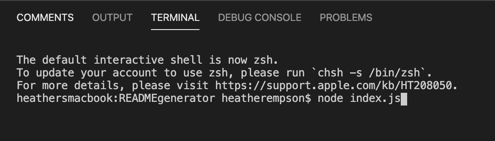
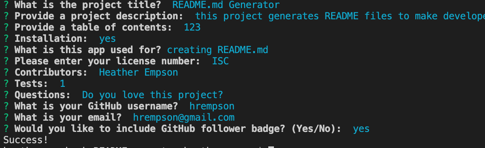
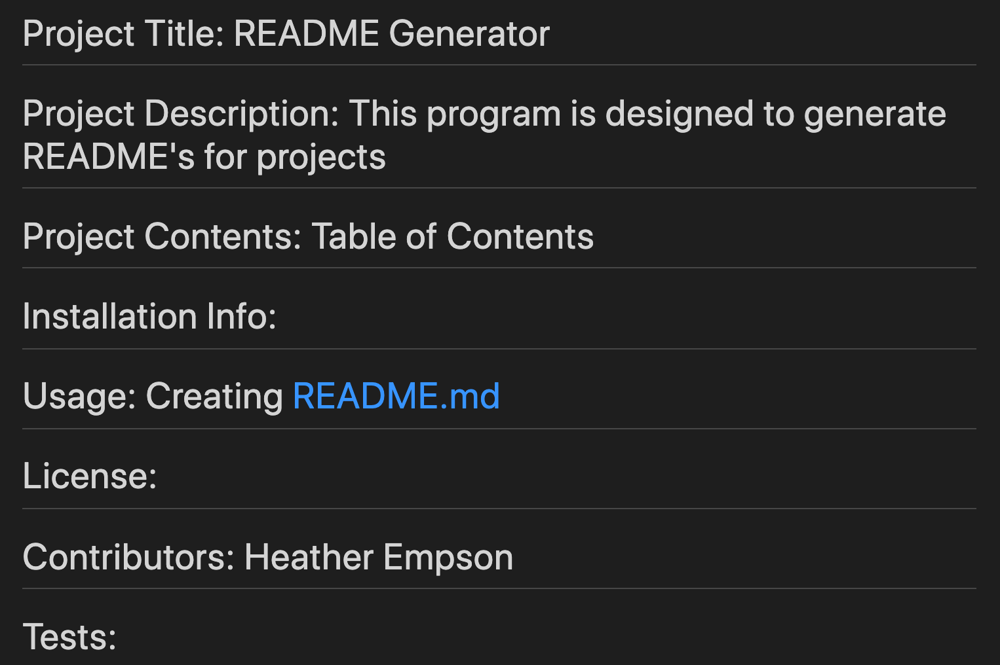
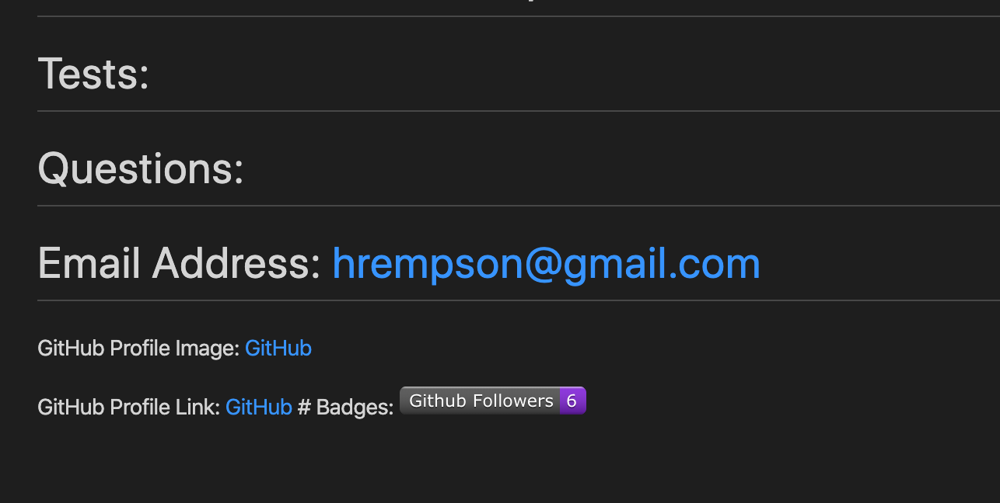

Created By : Heather Empson

Instructions - How to use the READMEGenerator :

Open file and run "npm i" in node.
When the user runs the READMEGenerator application in node :

It will then prompt the user with a series of questions to gather information to be included in the README markdown file :

When completed, the user will see a "Success" message and a README.md will be created, displaying the infromation provided in the prompts :

(Image 1/2)

(Image 2/2)
